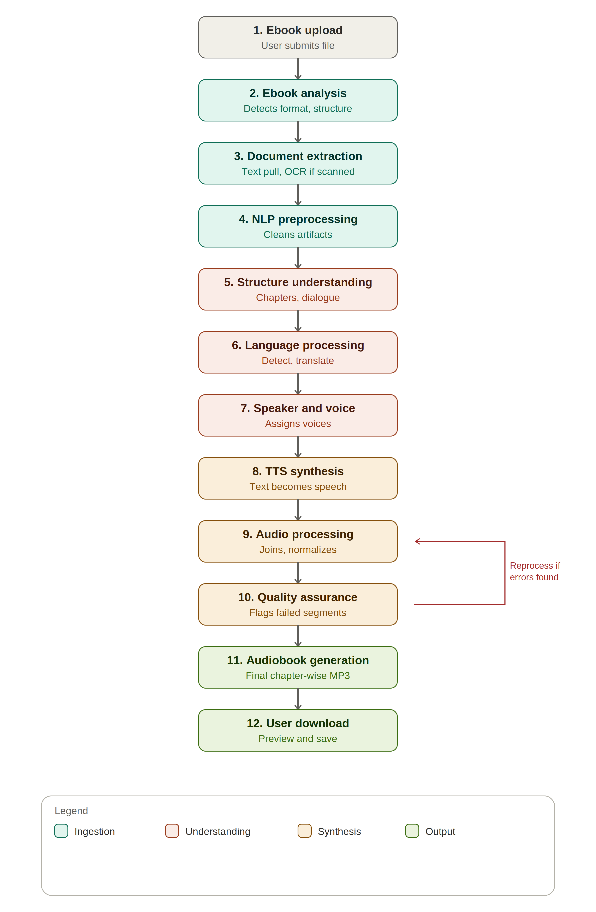

**PROJECT-I (AI24300)**

# Agentic AI-Based Ebook-to-Audiobook Conversion System

*Multi-voice audiobooks: one voice for the narrator and one for each character*

*Consolidated project document: proposal, scope, workflow, architecture, interface and work plan*

**B.Tech.-V CSE (AIML)**

**Submitted by:**

Akshat Rai — BTECH/15096/24

Divyanshu Bhusan — BTECH/15081/24

Under guidance of Dr. Naiyar Iqbal

Department of Computer Science & Engineering

Birla Institute of Technology, Mesra, Patna Campus

**Monsoon 2026**


## 1. Introduction

Digital reading has grown through widely available EPUB, PDF, MOBI and TXT ebooks, but continuous visual attention limits their usability while commuting, exercising, or for users who prefer auditory learning. Audiobooks address this by converting written content into spoken audio.

Conventional pipelines apply a straight sequence of text extraction followed by text-to-speech (TTS). They degrade badly on complex formatting, multi-chapter books, dialogue, scanned pages and multilingual content. This project proposes an Agentic AI-Based Ebook-to-Audiobook Conversion System: a locally hosted web application where specialised AI agents divide the conversion workflow into ingestion, understanding, synthesis and quality-controlled output stages.

Its distinguishing feature is **casting**. The system works out who speaks each line and gives the narrator and every character a consistent voice, the way a radio play would. The first working version targets English to prove the multi-voice pipeline. Hindi follows, then Bengali, Marathi, Telugu and Tamil, on an architecture that extends to more languages (Section 5.1).


## 2. Problem Statement

Real-world ebooks vary widely: different formats and structures, chapter headings, headers and footers, page numbers, tables, scanned pages needing OCR, multi-character dialogue, mixed languages and inconsistent punctuation. A simple TTS pipeline that treats all extracted text as one continuous stream produces unnatural pauses, mispronunciation, poor dialogue handling and loss of document structure. Existing open-source converters such as ebook2audiobook read a whole book in one voice, so a conversation between three characters sounds like one person.

Multilingual audiobook generation for Indian languages adds further challenges: language identification, translation, pronunciation, script handling, TTS model availability and voice consistency. The problem addressed is designing an agentic system that processes varied ebook formats, understands textual and structural content, performs NLP-based preprocessing and speaker analysis, and generates a coherent, chapter-organised, multi-voice audiobook.


## 3. Motivation and Significance

- **Accessibility:** an alternative channel for users who struggle with continuous reading.
- **Multilingual Indian-language support:** Hindi, Bengali, Marathi, Telugu and Tamil as the target set, not English only.
- **Multi-voice storytelling:** speaker attribution and casting turn dialogue into something a listener can follow without visual cues.
- **AI-based content understanding:** NLP and LLM-driven structure, chapter and dialogue awareness rather than raw character streaming.
- **Agentic AI:** specialised agents coordinated by an orchestrator that adapts its workflow to the input ebook.
- **Local processing:** reduced dependence on external cloud services and better privacy for the user’s books.
- **Academic significance:** combines NLP, LLM reasoning, TTS, document intelligence, multilingual processing, agentic AI and audio processing.

## 4. Objectives

- Build a web interface to upload ebooks and process them end to end. The first version accepts EPUB, TXT, DOCX and PDF (text layer). MOBI and other e-reader formats, and OCR for scans, follow in Phase B.
- Apply NLP to clean text and automatically identify chapters, sections, dialogue and speakers.
- Give the narrator and each character a separate voice that stays consistent across chapters, with a review screen so the user can change the casting.
- Support English first, then Hindi, Bengali, Marathi, Telugu and Tamil through language identification and AI-based TTS, with optional voice cloning in a later phase.
- Implement an agentic orchestration layer that coordinates the stages and produces chapter-wise MP3 files and an optional single M4B with chapter markers.
- Introduce automated quality checks and evaluate the audiobook with objective and subjective measures.

## 5. Project Definition and Scope


### 5.1 Phased scope

Project-I concentrates on problem analysis, architecture, technology selection, prototype design and feasibility evaluation. The work is split into phases so that each is small enough to finish and test. Phase A is the prototype built during Project-I; Phases B to D extend it afterwards and are not claimed as complete.

| **Phase** | **Included** |
|---|---|
| **A: MVP**<br>(Project-I) | Formats: EPUB, TXT, DOCX, PDF (text layer). Chapter detection. Speaker attribution by a local LLM. Character registry with alias merging. Voice casting with a review screen. TTS engines: XTTS-v2 and VITS. Language: English. Output: chapter-wise MP3 plus M4B with chapter markers. Resume after a crash or stop. React web interface on a FastAPI backend, a CLI for development, and a text box for short text. |
| **B: Formats** | OCR (Tesseract) for scanned pages and image formats. MOBI, AZW3, FB2 and other e-reader formats through a Calibre conversion bridge. |
| **C: Languages** | Hindi first (supported by XTTS-v2), then Bengali, Marathi, Telugu and Tamil using engines to be evaluated (for example Fairseq MMS-TTS voices). Language identification for mixed-language books, optional translation. |
| **D: Extras** | Voice cloning from a reference voice the user has permission to use. More TTS engines (Bark, Tortoise and others). SML-style tags for pauses and voice switching. More output formats. |


### 5.2 Constraints

- **Offline:** no network calls after models are downloaded.
- **Two hardware tiers:** narrator-only mode targets a floor of 2 GB RAM and 1 GB VRAM using VITS. Multi-voice mode needs a local LLM and so has a higher floor, proposed at 8 GB RAM (a 3B-class 4-bit model is roughly 2–3 GB). This is unbenchmarked until the Week 4 and Week 6 tests.
- **Sequential stages:** the LLM and the TTS model are never held in memory together.
- **Licences:** XTTS-v2 is released under the Coqui Public Model License, which restricts commercial use. Check each model licence before distributing the project.
- **Content:** only legally acquired or appropriately licensed books are used. Voice cloning is limited to reference voices the user has permission to use.

### 5.3 Success criteria

- At least 90% of quoted lines receive the correct speaker on a 3-chapter test set labelled by hand (a target, measured in Week 4).
- A character sounds the same in chapter 1 and chapter 30.
- A stopped or crashed run resumes without redoing finished segments.
- Chapter detection accuracy, TTS error rate (speech recognition against the source text) and listener ratings are reported in Week 10.

### 5.4 Glossary

**Segment:** one span of text with one speaker. **Cast:** the list of characters and their voices. **Alias:** another name for the same character. **Agent:** a stage owner with one job and a defined input and output.


## 6. How the System Should Work


### 6.1 Analogy

Think of a radio-play studio. The script editor marks who says each line, the casting director picks an actor for each role, the actors record their lines, and the sound engineer stitches the recordings into chapters. The agents play those four roles.


### 6.2 Twelve-stage pipeline

The conversion runs as twelve coordinated stages from upload to download. Each stage is owned by a dedicated agent. The Quality Assurance stage can send the job back to earlier stages when it finds missing chapters, silence or failed segments.

| **#** | **Group** | **Owner** | **What happens** | **Phase** |
|---|---|---|---|---|
| 1 | Ingestion | Web interface / API | User submits the file | A |
| 2 | Ingestion | Ebook Analysis Agent | Detects format and structure | A |
| 3 | Ingestion | Extraction Agent | Pulls text into a format-independent representation; OCR for scans | A text<br>B OCR |
| 4 | Ingestion | NLP Preprocessing Agent | Removes headers, page numbers and hyphenation; splits sentences and paragraphs | A |
| 5 | Understanding | Structure Analysis Agent | Finds chapters and marks dialogue spans | A |
| 6 | Understanding | Language Agent | Detects the language; translation later | A detect<br>C translate |
| 7 | Understanding | Speaker/Dialogue and Voice Selection Agents | Attributes each line to a speaker with the local LLM, merges aliases, casts voices | A |
| 8 | Synthesis | TTS Agent | Speaks each segment in its character’s voice | A |
| 9 | Synthesis | Audio Processing Agent | Adds pauses, levels loudness, joins per chapter | A |
| 10 | Synthesis | Quality Assurance Agent | Flags silence, missing chapters and failed segments; triggers reprocessing | A |
| 11 | Output | Audio Processing Agent | Writes chapter-wise MP3 and the M4B with chapter markers | A |
| 12 | Output | Web interface | Preview and download | A |



*Figure 1. Twelve-stage conversion pipeline (from the original proposal). OCR and translation switch on in later phases.*


### 6.3 Worked example (invented text)

```text
Input:  Mira set the lamp down. "You lied to me," she said.
        "I did not," Tomas answered.
Output: [narrator] Mira set the lamp down.
        [Mira]     You lied to me,
        [narrator] she said.
        [Tomas]    I did not,
        [narrator] Tomas answered.
```


### 6.4 Rules

- Dialogue tags such as “she said” go to the narrator.
- When the speaker is unknown, label the segment **unknown**, speak it in the narrator voice and list it for review. The system never guesses silently.
- Thoughts and letters read aloud default to the narrator, switchable per character.
- Every LLM output is validated as JSON. Invalid output is retried, then falls back to the narrator.
- Each finished segment is cached, so re-runs and resumes are cheap.

### 6.5 Modes

**Narrator-only** skips attribution, uses one voice and runs on the low-resource floor. **Multi-voice** runs the full pipeline.


## 7. System Architecture and Wiring


### 7.1 Orchestrator and agents

An Agent Orchestrator runs the stages as a graph over a shared job state stored in SQLite. LangGraph will be evaluated in Week 5 against a plain state machine, and the simpler option wins if LangGraph adds weight without benefit. The ten agents map onto six modules:

| **Agents** | **Module** | **In** | **Out** | **Heavy model** |
|---|---|---|---|---|
| Ebook Analysis, Extraction | ingest/ | EPUB, TXT, DOCX, PDF | book.json (chapters, paragraphs) | none |
| NLP Preprocessing, Structure Analysis | chunker/ | book.json | chunks | none (spaCy) |
| Speaker/Dialogue, Language | attribution/ | chunks + cast so far | segments.json | local LLM (llama.cpp) |
| Voice Selection | casting/ | segments | cast.json (characters, aliases, voices) | none |
| TTS | tts/ | segments + cast | WAV per segment | XTTS-v2 or VITS |
| Audio Processing, Quality Assurance | audio/ | WAV files | chapter MP3s, M4B | none (FFmpeg) |


### 7.2 Data contract

```text
segment:   { "id": "c03-p012-s2", "chapter": 3, "speaker": "Mira",
             "kind": "dialogue | narration | thought",
             "text": "...", "status": "pending | done" }
character: { "name": "Mira", "aliases": ["Ms. Vane"],
             "voice": { "engine": "xtts", "id": "..." } }
```


### 7.3 Storage and engine adapter

Each book gets one project folder holding book.json, segments.json, cast.json, an audio folder and state.sqlite (stage status per chunk, used for resume). Every TTS engine implements one interface: synthesize(text, voice) returning a WAV, list_voices(), and max_chars. A new engine later means a new adapter only.


### 7.4 Design caveats

- **Memory:** load the LLM, finish attribution, unload it, then load the TTS model.
- **Context limits:** a small model cannot hold a chapter. Chunk at paragraph edges, pass the running cast list, and recheck alias merges in the casting stage.
- **Engine text limits:** XTTS-class models cap the characters per call, so split at sentence edges.
- **Voice drift:** fix each character’s voice in cast.json and never re-pick it at synthesis time.
- **Speed:** a full novel is many hours of CPU synthesis. Show an ETA and support pause and resume.
- **Hindi support:** some earlier local XTTS installs rejected the Hindi language code, so pin a current maintained release and test Hindi in Week 7.

## 8. Methodologies


### 8.1 Document processing

Document-processing libraries extract text from each supported format into a format-independent intermediate representation, so downstream agents stay decoupled from the file type.


### 8.2 Natural language processing

NLP handles text normalisation, sentence and paragraph segmentation, chapter detection, dialogue detection, language identification and TTS-ready text preparation. A local quantised LLM performs speaker attribution and alias resolution, returning strict JSON that is validated before use.


### 8.3 Agentic AI architecture

Specialised agents (Ebook Analysis, Extraction, NLP Preprocessing, Structure Analysis, Language, Speaker/Dialogue, Voice Selection, TTS, Audio Processing and Quality Assurance) are coordinated by the Agent Orchestrator.


### 8.4 Text-to-speech and voice cloning

XTTS-v2 is the primary candidate for quality and later voice cloning. It supports 17 languages, of which Hindi is the only Indian language, so Bengali, Marathi, Telugu and Tamil need other engines in Phase C. VITS is the low-resource fallback. Candidates are compared on language coverage, speech quality, inference speed, hardware needs and licensing in Week 6. Voice cloning stays optional and limited to permitted reference voices.


### 8.5 Multilingual and audio processing

The language layer is modular. Generated segments are ordered, paused, loudness-normalised, joined per chapter and exported as MP3 and M4B with FFmpeg.


### 8.6 Quality evaluation

Evaluation covers conversion success rate, processing time, audio duration, speech intelligibility, pronunciation quality, speaker consistency, speaker attribution accuracy, chapter detection accuracy, TTS error rate and subjective listener ratings. Speech recognition is used to estimate transcription error against the source text.


## 9. Technology Stack

| **Component** | **Technology** | **Purpose** | **Phase** |
|---|---|---|---|
| Frontend | React.js | Upload, cast review, progress, preview, download | A |
| Backend | Python + FastAPI | API layer, job management, agent execution | A |
| AI / ML | PyTorch | Running and integrating models | A |
| NLP | spaCy + Hugging Face Transformers | Segmentation, language and structure analysis | A |
| Speaker attribution | Local quantised LLM via llama.cpp (3B-class, benchmarked in Week 4) | Who speaks each line, alias resolution | A |
| TTS | XTTS-v2 and VITS | Speech synthesis; VITS as low-resource fallback | A |
| Audio | FFmpeg + Python audio libraries | Conversion, normalisation, chapters, MP3 and M4B | A |
| Database | SQLite | Jobs, settings, cast, per-chunk stage status | A |
| Agent framework | LangGraph (to be evaluated) | Orchestration and state management | A |
| OCR | Tesseract (to be evaluated) | Text from scanned pages | B |
| Format bridge | Calibre ebook-convert | MOBI, AZW3, FB2 to a readable format | B |
| Indian-language TTS | Fairseq MMS-TTS and others (to be evaluated) | Bengali, Marathi, Telugu, Tamil | C |


## 10. User Interface

A locally hosted React web interface talks to the FastAPI backend. Four screens cover the whole flow. Each action keeps one name from button to confirmation (Start conversion, then Converting).

**Screen 1: Import**

```text
Drop a book here (.epub .txt .docx .pdf)
Mode:  ( ) Narrator only   (o) Multi-voice
TTS engine: [XTTS-v2]    Output: [MP3 + M4B]
[Analyse book]
Quick text: [ short text box ]  [Speak]
```

**Screen 2: Cast review**

```text
Mira (412 lines)   aliases: Ms. Vane   voice [Female warm]  [Play sample]
Tomas (398 lines)   voice [Male deep]  [Play sample]
Narrator   voice [Calm]  [Play sample]
Unknown speakers (7): [Review lines]
[Merge characters]   [Start conversion]
```

**Screen 3: Progress**

```text
Chapter 4 of 27, segment 118 of 640
[=====>          ]  ETA 3 h 10 min
[Pause]  [Stop]   (safe to resume)
```

**Screen 4: Library**

```text
Book title: chapter list with play buttons
[Download MP3s]  [Download M4B]  [Open folder]
[Re-cast and redo changed lines]
```


## 11. Data Required

- **Ebooks:** non-DRM books in EPUB, TXT, DOCX and PDF for development and testing (MOBI and scans in Phase B).
- **Text data:** extracted text for testing cleaning, chapter detection, dialogue detection, speaker attribution and language identification.
- **Labelled test set:** three chapters with the speaker of every quoted line labelled by hand, used to measure attribution accuracy.
- **Speech data:** publicly available, appropriately licensed speech samples for TTS and voice-cloning tests.
- **Multilingual data:** representative text and speech samples for Hindi, Bengali, Marathi, Telugu and Tamil (Phase C).
Only legally acquired or appropriately licensed content is used throughout development and evaluation.


## 12. Work Plan

Each of the twelve phases is scoped to one week. Week 1 is assumed to start on Monday 5 October 2026; adjust the dates to the semester calendar.

| **Week** | **Starts** | **Phase** | **Deliverable** |
|---|---|---|---|
| 1 | 5 Oct | Literature review and requirement analysis | Problem definition, technology selection, labelled test set chosen |
| 2 | 12 Oct | Ebook format analysis and text extraction | Ingestion module for EPUB, TXT, DOCX, PDF |
| 3 | 19 Oct | NLP preprocessing | Clean structured text |
| 4 | 26 Oct | Chapter and dialogue analysis | Structured ebook representation; local LLM attribution accuracy measured on 3 labelled chapters (go/no-go on model size) |
| 5 | 2 Nov | Agent architecture design | Multi-agent workflow; LangGraph vs plain state machine decided |
| 6 | 9 Nov | TTS model evaluation | Selected TTS pipeline; XTTS-v2 and VITS speed and quality tested on the project machine |
| 7 | 16 Nov | Multilingual processing | Language identification; Hindi feasibility check; coverage check for Bengali, Marathi, Telugu, Tamil |
| 8 | 23 Nov | Audio generation | Chapter-wise audio with per-character voices; resume works |
| 9 | 30 Nov | Web application development | Functional local web interface (React + FastAPI) |
| 10 | 7 Dec | Quality assurance and evaluation | Performance evaluation against the success criteria |
| 11 | 14 Dec | Integration | Complete prototype (Phase A) |
| 12 | 21 Dec | Documentation | Final project documentation |


### After Project-I

| **Phase** | **Work** |
|---|---|
| B | OCR and image formats; Calibre bridge for MOBI, AZW3, FB2 |
| C | Hindi, then Bengali, Marathi, Telugu, Tamil; translation |
| D | Voice cloning, extra engines, SML-style tags, more output formats |


## 13. Risks and Mitigations

| **Risk** | **Why it matters** | **Mitigation** |
|---|---|---|
| Small local LLM misattributes speakers | Wrong voice on a line breaks the listening experience | Strict JSON validation, narrator fallback, cast review screen, accuracy measured in Week 4 |
| XTTS-v2 does not cover most target Indian languages | Only Hindi is supported among the five | Hindi first; evaluate Fairseq MMS-TTS and others for the rest in Phase C |
| Hardware floor too low for multi-voice | A local LLM needs more memory than the reference tool’s floor | Two tiers; sequential model loading; benchmark in Weeks 4 and 6 |
| Synthesis takes too long | A novel is many hours of audio on CPU | ETA, pause and resume, fast VITS voices for drafts |
| Model licences block sharing | XTTS-v2 restricts commercial use | Check licences in Week 1; keep engines behind an adapter |
| Orchestration framework adds overhead | LangGraph may be more than a 10-stage pipeline needs | Decide in Week 5 against a plain state machine |


## 14. Expected Outcomes

- Support for EPUB, TXT, DOCX and PDF with automated extraction and preprocessing, and a path to MOBI and scanned books.
- Automatic chapter and document-structure identification.
- LLM-based dialogue and speaker attribution with a character registry and per-character voices.
- AI-based TTS and chapter-wise MP3 plus M4B output, in English first and in Hindi, Bengali, Marathi, Telugu and Tamil subject to model availability.
- Optional voice cloning as an advanced feature, if technically feasible.
- Automated validation of generated audiobook segments.
- A locally hosted web interface and an extensible agentic architecture for more agents, languages and TTS models.
- Quantitative and qualitative evaluation of audiobook quality.
The project will demonstrate how AI agents can coordinate document intelligence, NLP, multilingual processing, speech synthesis and audio processing to automate a complex end-to-end media-generation task.


## Acknowledgement

We gratefully acknowledge Dr. Naiyar Iqbal for guidance and feedback on the system design, and the Department of Computer Science & Engineering, BIT Mesra, Patna Campus, for the opportunity to pursue this project. The following related research papers informed the technical direction and are gratefully acknowledged:

- Casanova et al., XTTS: A Massively Multilingual Zero-Shot Text-to-Speech Model (Interspeech 2024) — https://arxiv.org/abs/2406.04904
- AI4Reading: Chinese Audiobook Interpretation System Based on Multi-Agent Collaboration — https://arxiv.org/pdf/2512.23300
- Audiobooks and Artificial Intelligence: Tools for Synthetic Audiobook Creation and Implications for the Publishing Industry, Publishing Research Quarterly — https://link.springer.com/article/10.1007/s12109-025-10049-1
- MParrotTTS: Multilingual Multi-speaker Text to Speech Synthesis in Low Resource Setting — https://arxiv.org/pdf/2305.11926
- MahaTTS: A Unified Framework for Multilingual Text-to-Speech Synthesis — https://arxiv.org/pdf/2508.14049
- Agentic-AI Healthcare: Multilingual, Privacy-First Framework with MCP Agents (reference architecture for multilingual agent orchestration) — https://arxiv.org/pdf/2510.02325

## References

- Drew Thomasson, ebook2audiobook: Generate audiobooks from e-books, voice cloning and 1158+ languages, GitHub repository.
- ebook2audiobook documentation and README: supported formats, TTS engines, languages, voice cloning, output formats.
- Coqui AI, XTTS-v2 model card, Hugging Face: supported languages and Coqui Public Model License.
- PyTorch Documentation — framework for machine learning and deep learning model execution.
- Hugging Face Transformers Documentation — libraries and models for NLP and machine learning.
- FastAPI Documentation — framework for building Python-based APIs.
- FFmpeg Documentation — multimedia framework for audio and video processing.

## Bibliography

- Drew Thomasson, ebook2audiobook, GitHub — open-source ebook-to-audiobook conversion project.
- PyTorch, PyTorch Documentation — open-source machine learning framework.
- Hugging Face, Transformers Documentation — open-source machine learning and NLP ecosystem.
- FastAPI, FastAPI Documentation — Python web framework documentation.
- FFmpeg Developers, FFmpeg Documentation — multimedia processing framework.
- LangChain, LangGraph Documentation — framework for building stateful agentic AI workflows.
- Relevant literature on multilingual TTS, speaker diarization, dialogue detection, document understanding, OCR and agentic AI.